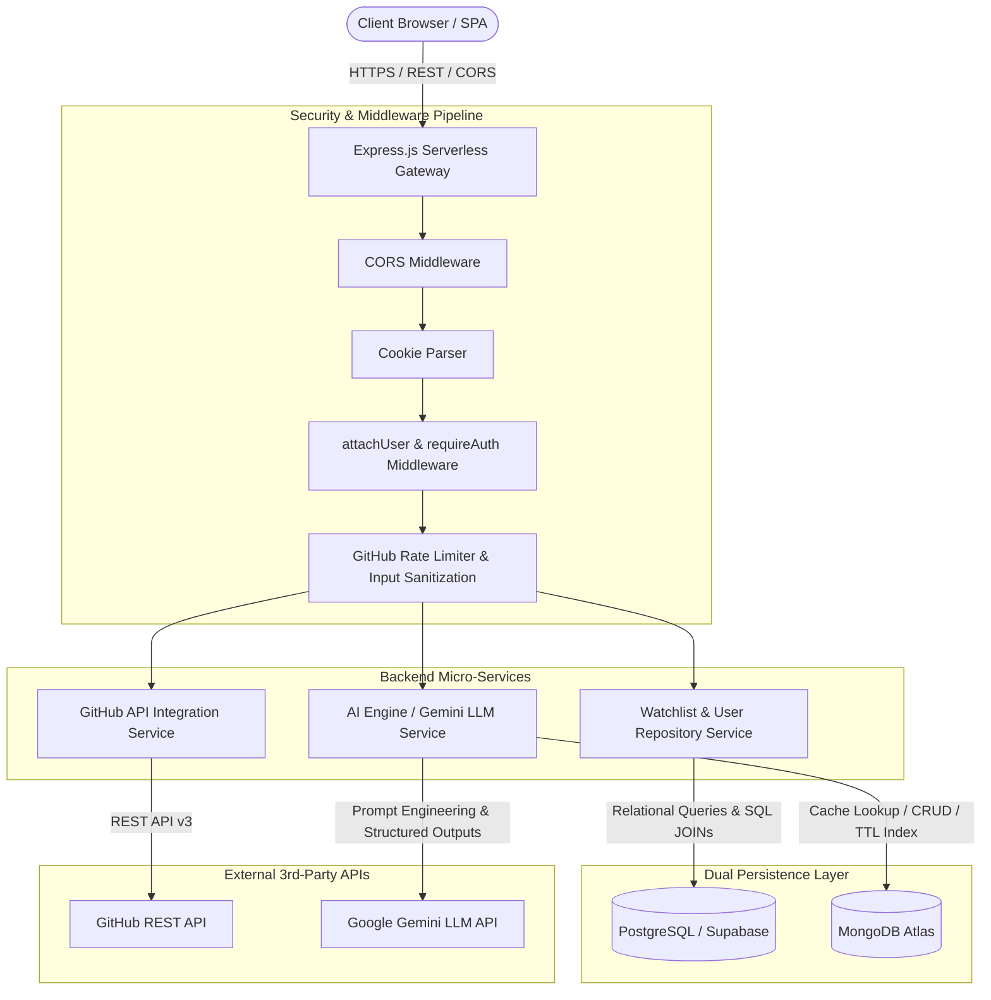

# High-Level Design (HLD)

## 1. System Architecture Overview
AlgoMerge is an AI-powered developer platform designed to help open-source contributors triage issues, predict merge probabilities, and generate step-by-step implementation plans. It follows a modern 3-tier distributed architecture with a decoupled frontend client, a scalable serverless backend API, a dual-persistence database layer, and integrations with external AI and developer APIs.

### Technology Stack
*   **Frontend Client:** React 18, Vite, TypeScript, Tailwind CSS, Framer Motion, Lucide Icons.
*   **Backend API Gateway:** Node.js, Express.js (deployed as serverless functions on Vercel), TypeScript.
*   **Relational Database (SQL):** PostgreSQL (hosted on Supabase) for transactional user data, watchlists, and relational relationships with primary/foreign keys.
*   **NoSQL Database:** MongoDB Atlas (Mongoose ODM) for unstructured AI analysis caching and TTL indexed storage.
*   **External Integrations:** Google Gemini Pro / Flash SDK (`@google/genai`), GitHub REST API.
*   **Security & Auth:** GitHub OAuth 2.0 3rd-party login, stateless JWT tokens with HTTP-only cookies, custom authentication middleware, rate limiting.

---

## 2. Architecture & Service Topology Diagram

---

## 3. Core Functional Modules

### 3.1 Authentication & Security Architecture
*   **OAuth / 3rd-Party Login:** Implements GitHub OAuth web application flow (`/api/auth/github` -> GitHub Login -> `/api/auth/github/callback`).
*   **JWT Issuance & Verification:** On successful callback, backend generates a signed JSON Web Token (JWT) containing `userId`, `username`, and `avatarUrl` using `jsonwebtoken`, stored in `httpOnly` secure cookies.
*   **Middleware Pipeline:** Custom `attachUser` middleware inspects session cookies and attaches decoded user claims to `req.user` without throwing fatal errors. Route guards (`requireAuth`) enforce role-based access control.
*   **Input Sanitization & Injection Defense:** URL parameters and query parameters are strictly validated and escaped before query execution.
*   **Secrets Management:** Environment variables (`.env`, `process.env.GEMINI_API_KEY`, `process.env.GITHUB_CLIENT_SECRET`) managed via Vercel secrets and local dotenv.

### 3.2 AI Application Engineering
*   **LLM API Integration:** Interfaces with Google Gemini 2.5 Flash via `@google/genai`.
*   **Prompt Engineering:** Rigorous multi-stage system prompts specifying persona, markdown format constraints, time/space complexity expectations, and implementation steps.
*   **Structured Outputs:** AI models produce deterministic, structured JSON and markdown plans parsed and sanitized by backend controllers.
*   **AI Caching Mechanism:** Uses MongoDB compound indexes `(owner, repo, issueTitle)` to check for cached analyses prior to triggering Gemini API calls, drastically cutting token usage and avoiding rate limits.

### 3.3 Relational & NoSQL Data Strategy
*   **PostgreSQL (Supabase):** Manages relational entities (`users`, `tracked_repositories`) with Primary Key (PK) / Foreign Key (FK) constraints, cascading deletes, indexes (`idx_users_github_id`, `idx_tracked_repositories_user_id`), and SQL JOIN queries.
*   **MongoDB:** Stores semi-structured, heavy AI analysis documents with schema validation, Mongoose models, TTL expiration, and compound indexing.

### 3.4 Frontend Architecture
*   **React Component Composition:** Reusable design system (`IssueCard`, `PRCard`, `Navigation`, `RepoCard`).
*   **State & Lifecycle Management:** Built using `useState`, `useEffect` with `AbortController` cancellation for async data fetching, and custom context.
*   **Responsive Layout:** Tailwind CSS responsive utilities (`flex`, `grid`, `line-clamp`, breakpoint modifiers `md:`, `lg:`).
*   **Client-Side Routing:** Fast SPA routing with dynamic URL parameters and error boundaries.

---

## 4. Engineering Practices & Deployment
*   **Git Workflow:** Strict feature branching model (`feat/*`, `fix/*`), descriptive conventional commits, and Pull Request (PR) code reviews.
*   **Serverless Deployment:** Monorepo deployment on Vercel with rewrite rules routing `/api/*` to serverless function endpoints and frontend static assets.
*   **Error Handling Strategy:** Comprehensive `try...catch` blocks across async handlers, mapping specific domain errors to standard HTTP status codes (`400`, `401`, `403`, `404`, `429`, `500`) while withholding sensitive stack traces from client responses.
