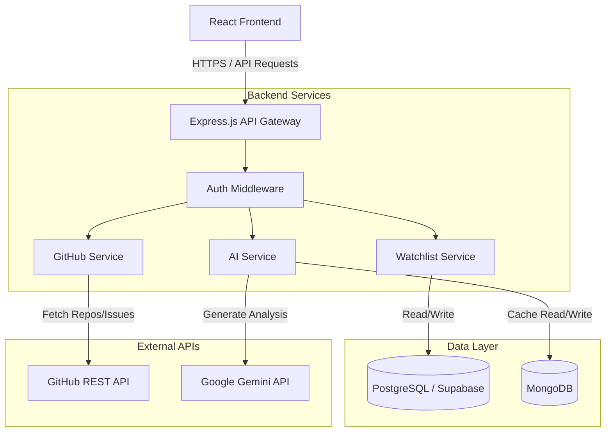

# High-Level Design (HLD)

## 1. System Architecture Overview
AlgoMerge utilizes a standard 3-tier architecture with a decoupled frontend and backend, supplemented by a dual-database persistence layer and integration with third-party APIs.

### The Stack
*   **Frontend:** React 18, Vite, Tailwind CSS, Lucide Icons.
*   **Backend:** Node.js, Express.js (deployed via Vercel Serverless Functions).
*   **Relational Database:** PostgreSQL (Supabase) for structured user and tracking data.
*   **NoSQL Database:** MongoDB (Mongoose) for unstructured AI caching.
*   **External APIs:** GitHub REST API, Google Gemini API.

## 2. Architecture Diagram

## 3. Data Flow
1.  **Authentication:** The client authenticates directly via Supabase. Supabase provides a JWT which the client includes in the `Authorization` header for all backend requests.
2.  **Fetching Issues:** The client requests `/api/issues/:owner/:repo`. The Express backend queries the GitHub API, calculates merge probabilities locally using the scoring engine, and returns the JSON payload.
3.  **AI Analysis (Caching Strategy):**
    *   The client requests an AI analysis for a specific issue.
    *   The backend's AI Service first checks **MongoDB** for a cached response for this specific `owner/repo/issue`.
    *   If found (Cache Hit), it returns the data instantly.
    *   If not found (Cache Miss), it calls the **Google Gemini API**, awaits the response, saves the result asynchronously to MongoDB, and returns the data to the client.

## 4. Deployment Strategy
*   **Frontend & Backend:** Hosted on **Vercel**. The Express app is wrapped in a serverless function (`api/index.ts`) allowing seamless, scalable execution without managing infrastructure.
*   **Database:** Supabase manages the managed PostgreSQL instance, while MongoDB Atlas hosts the NoSQL cluster. Both are accessed securely via environment variables.
