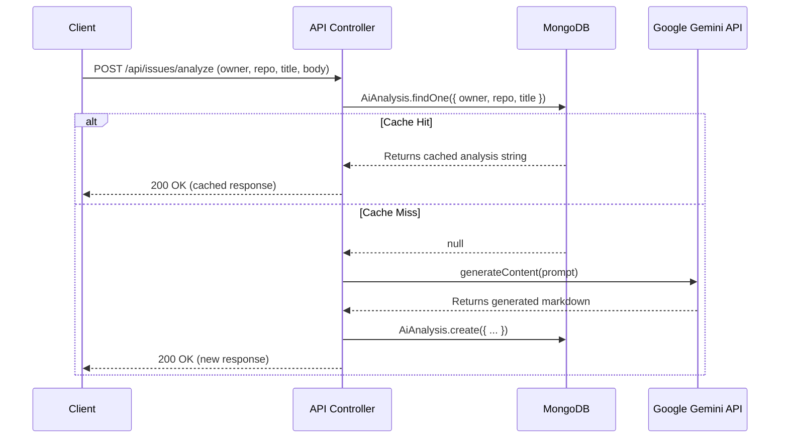

# Low-Level Design (LLD)

## 1. Database Schemas

### 1.1 PostgreSQL (Supabase) - Relational Data
We use PostgreSQL to store strict, relational data regarding users and their tracked repositories.

**Table: `users`**
*   `id` (UUID, Primary Key) - Matches the Supabase Auth UUID.
*   `email` (String, Unique)
*   `created_at` (Timestamp)

**Table: `tracked_repositories`**
*   `id` (UUID, Primary Key)
*   `user_id` (UUID, Foreign Key -> `users(id)`)
*   `owner` (String) - GitHub repository owner.
*   `repo` (String) - GitHub repository name.
*   `created_at` (Timestamp)

*Relationships:* One-to-Many (`users` can have many `tracked_repositories`).

### 1.2 MongoDB - NoSQL Caching Data
We use MongoDB to cache the dynamic, unstructured text generated by the LLM. 

**Collection: `aianalyses`**
Defined via Mongoose Schema (`AiAnalysisSchema`):
*   `owner` (String, Indexed)
*   `repo` (String, Indexed)
*   `issueTitle` (String, Indexed)
*   `analysis` (String) - The raw markdown generated by Gemini.
*   `isPR` (Boolean)
*   `createdAt` (Date, default: Date.now)

*Indexes:* A compound index is built on `{ owner: 1, repo: 1, issueTitle: 1 }` for rapid cache lookups.

## 2. API Endpoints

| Endpoint | Method | Middleware | Description |
| :--- | :--- | :--- | :--- |
| `/api/issues/:owner/:repo` | GET | `authenticate` | Fetches open issues from GitHub for a specific repo, computes scoring metrics, and returns a JSON array. |
| `/api/issues/analyze` | POST | `authenticate` | Accepts an issue title and body. Checks MongoDB cache; if empty, generates a plan via Gemini API, caches it, and returns the markdown string. |
| `/api/watchlist` | GET | `authenticate` | Uses Supabase SQL JOIN to fetch the authenticated user's `tracked_repositories`. |
| `/api/watchlist` | POST | `authenticate` | Inserts a new row into `tracked_repositories` linked to the user's ID. |
| `/api/watchlist/:owner/:repo` | DELETE | `authenticate` | Deletes a row from `tracked_repositories` based on user ID and repo details. |

## 3. Core Component Interactions (Sequence Diagram for AI Analysis)

## 4. Error Handling & Middlewares
*   **Auth Middleware (`auth.middleware.ts`):** Extracts Bearer token from headers, verifies it against Supabase (`supabase.auth.getUser()`), and attaches the user object to the Express `req`. Throws `401 Unauthorized` if invalid.
*   **Error Catching:** All controllers wrap asynchronous logic in `try...catch` blocks.
    *   If GitHub API rate limits are hit, it throws `403` or `429`.
    *   If Gemini fails (e.g. invalid API key), it parses the exact `error.message` and forwards it as a `500` status so the client UI can render the exact failure reason.
