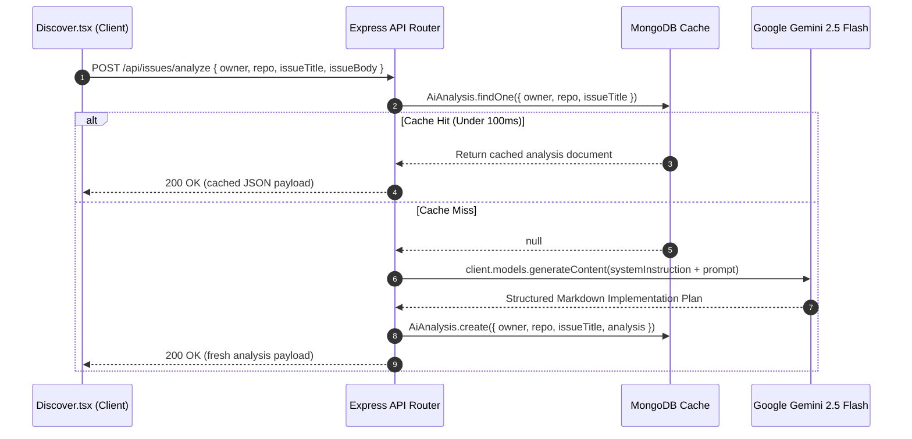

# Low-Level Design (LLD)

## 1. Database Schemas & Persistence Mechanics

### 1.1 PostgreSQL (Supabase) - Relational Schema & Indexing
Implemented in `supabase_migration.sql`. Models strict relational entities with primary/foreign keys and compound uniqueness constraints.

**Table: `public.users`**
*   `id` (BIGINT / UUID, Primary Key, auto-increment / generated)
*   `github_id` (TEXT, NOT NULL, UNIQUE, Indexed)
*   `username` (TEXT, NOT NULL)
*   `avatar_url` (TEXT)
*   `created_at` (TIMESTAMPTZ, DEFAULT NOW())
*   *Index:* `CREATE INDEX idx_users_github_id ON public.users (github_id);` (optimizes $O(1)$ lookup during OAuth callback upsert).

**Table: `public.tracked_repositories`**
*   `id` (BIGSERIAL, Primary Key)
*   `user_id` (BIGINT, Foreign Key -> `users(id)` ON DELETE CASCADE)
*   `repo_name` (TEXT, NOT NULL)
*   `created_at` (TIMESTAMPTZ, DEFAULT NOW())
*   *Compound Constraint:* `CONSTRAINT unique_user_repo UNIQUE (user_id, repo_name);`
*   *Index:* `CREATE INDEX idx_tracked_repositories_user_id ON public.tracked_repositories(user_id);` (accelerates SQL `LEFT JOIN` operations when fetching user watchlists).

### 1.2 MongoDB (Mongoose) - NoSQL Dynamic Caching
Implemented in `src/server/models/aiAnalysis.model.ts`.

**Schema: `AiAnalysisSchema` (`ai_analyses` collection)**
```typescript
interface IAiAnalysis extends Document {
  owner: string;
  repo: string;
  issueTitle: string;
  analysis: string;
  isPR: boolean;
  createdAt: Date;
}
```
*   **Compound Index:** `{ owner: 1, repo: 1, issueTitle: 1 }` with unique constraint for high-speed cache lookups.
*   **TTL Index:** Optional 7-day TTL index on `createdAt` for automated cache invalidation.

---

## 2. API Specifications & RESTful Endpoints

| Route | HTTP Verb | Middleware Pipeline | Controller Method | Status Codes | Description |
| :--- | :--- | :--- | :--- | :--- | :--- |
| `/api/auth/github` | `GET` | None | `githubLogin` | `302` | Initiates OAuth flow by redirecting to GitHub login. |
| `/api/auth/github/callback` | `GET` | None | `githubCallback` | `302`, `400`, `500` | Exchanges code for access token, fetches profile, upserts user in Postgres, issues JWT cookie. |
| `/api/auth/session` | `GET` | `attachUser` | `getSession` | `200`, `401` | Returns session user claims if authenticated. |
| `/api/auth/logout` | `POST` | `attachUser` | `logout` | `200` | Clears `auth_token` cookie. |
| `/api/issues/:owner/:repo` | `GET` | `attachUser` | `getIssues` | `200`, `400`, `404`, `500` | Retrieves issues from GitHub REST API, calculates heuristics (`mergeProbability`, `complexity`), returns enriched JSON array. |
| `/api/issues/analyze` | `POST` | `attachUser` | `analyzeIssueHandler` | `200`, `400`, `500` | Accepts issue details. Checks Mongo cache; falls back to Gemini API prompt, stores in Mongo, returns markdown. |
| `/api/watchlist` | `GET` | `attachUser`, `requireAuth` | `getWatchlist` | `200`, `401`, `500` | Executes SQL JOIN query on Postgres to return user's tracked repositories. |
| `/api/watchlist` | `POST` | `attachUser`, `requireAuth` | `addWatchlist` | `200`, `400`, `401`, `500` | Inserts repository into user's watchlist with duplicate conflict handling. |
| `/api/trending` | `GET` | None | `getTrendingRepos` | `200`, `500` | Fetches trending developer repositories. |

---

## 3. Middleware Architecture

Implemented in `src/server/middleware/auth.ts`:

1.  **`attachUser` Middleware:**
    *   Reads `auth_token` from cookies or `Authorization: Bearer <token>`.
    *   Calls `verifyToken(token)`.
    *   If valid, attaches `{ userId, username, avatarUrl }` to `req.user`.
    *   If invalid or absent, catches error and returns `null`, calling `next()` to ensure non-blocking graceful degradation.
2.  **`requireAuth` Middleware:**
    *   Inspects `req.user`.
    *   If `undefined`, halts request and returns `res.status(401).json({ error: 'Authentication required' })`.

---

## 4. AI Prompt Engineering & Execution Sequence

Implemented in `src/server/services/ai.service.ts`:



---

## 5. Frontend Component Architecture & State Management

*   **`Discover.tsx`:** Manages controlled inputs (`repo`, `presetName`), state variables (`issues`, `loading`, `filter`, `trendingLoading`), and handles form submissions with `e.preventDefault()`. Cancels stale promises using `AbortController`.
*   **`PRCard.tsx` / `IssueCard.tsx`:** Modular presentational components styled with Tailwind CSS (`flex flex-col`, `grid grid-cols-3 gap-px`, `line-clamp-2`, `truncate`) and animated with Framer Motion (`useInView`, `motion.div`).
*   **Data Integrity & Closures:** Synchronizes filter state via direct event handlers (`handleFilterClick(newFilter)`) to eliminate stale closures in `useEffect`.
